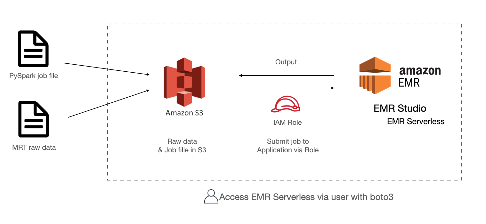
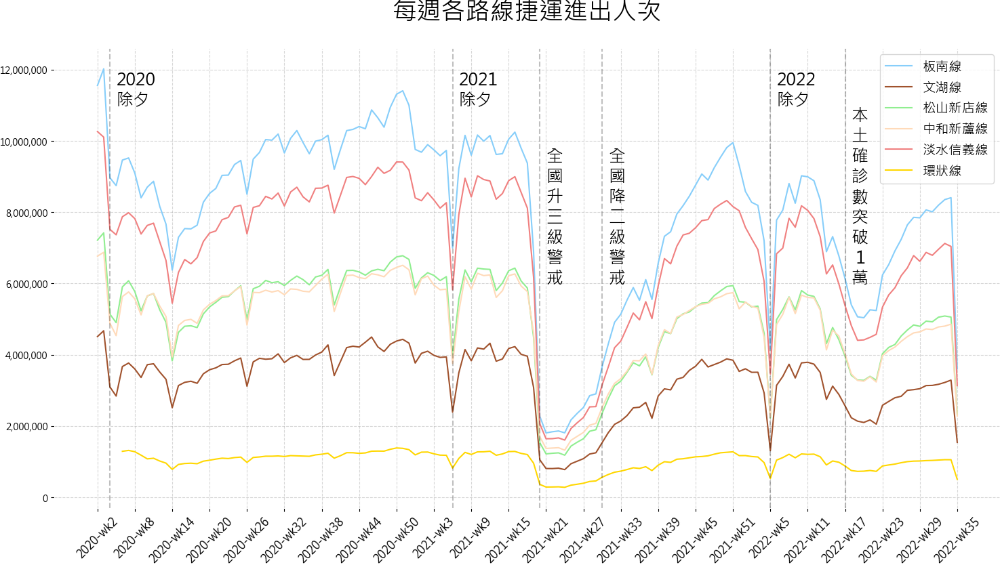

# Calculate MRT data with AWS EMR Serverless

Use EMR Serverless with Boto3

<p align="center">
  
</p>


## Files
- `generate-parquet.ipynb`
    - Download source data and transform into `parquet` format
- `credentials_example.cfg`
    - Credentials required for running `EMR Serverless`.
- `emr-serverless-IaC-functional.ipynb`
    - Set up an `Application` in `EMR Studio`.
    - Generate required `role`, `policy` and attach it to the role.
    - Submit `job` to the `Application` and track the status
- `read_outputs.ipynb`
    - read outputs in `S3` with `awswrangler`
    - visualize data with `matplotlib`

## Steps
- Generate a programmatic access user with policy as below:
    ```
    {
        "Version": "2012-10-17",
        "Statement": [
            {
                "Sid": "VisualEditor0",
                "Effect": "Allow",
                "Action": [
                    "emr-serverless:*",
                    "iam:GetAccountAuthorizationDetails"
                ],
                "Resource": "*"
            },
            {
                "Sid": "VisualEditor1",
                "Effect": "Allow",
                "Action": [
                    "s3:PutObject",
                    "s3:GetObject",
                    "s3:ListBucket",
                    "s3:DeleteObject"
                ],
                "Resource": [
                    "arn:aws:s3:::tpe-mrt-data",
                    "arn:aws:s3:::tpe-mrt-data/*"
                ]
            }
        ]
    }
    ```
- update `access_key`, `secret_access_key` and `user_account_id` in `credentials_example.cfg`
- rename `credentials_example.cfg` to `credentials.cfg`
- run `emr-serverless-IaC-functional.ipynb`
- read output with `read_outputs.ipynb`

## Output
<p align="center">
  
</p>
  